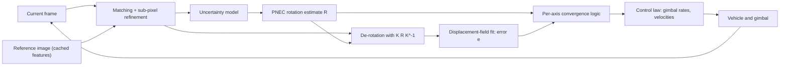
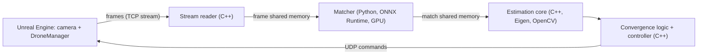

Draft material · Methodology and Implementation chapters

# Monocular visual repositioning of a UAV camera to a reference image

This draft describes the method and its implementation as two thesis chapters. Sections are numbered so they can be lifted directly. Citations are given as (Author, year) and listed at the end. The wording is meant to be adapted, not pasted.

# Chapter A Methodology

## A.1 Problem statement

Given a reference image $I_t$ captured from an unknown pose, the task is to return a UAV-mounted camera to that pose using only the images it observes. No map, depth sensor, satellite positioning or prior knowledge of the scene is used. The camera is modelled as a calibrated pinhole camera with intrinsic matrix $K$. For a point expressed in the target camera frame $\mathbf{X}_t$ and in the current camera frame $\mathbf{X}_c$,

$$ \mathbf{X}_c = R\,\mathbf{X}_t + \mathbf{t}, \label{eq:pose} $$

where $R \in SO(3)$ is the relative rotation and $\mathbf{t}$ is the position of the target camera expressed in current-camera axes (OpenCV convention: $x$ right, $y$ down, $z$ forward). Repositioning means driving $R \to I$ and $\mathbf{t} \to \mathbf{0}$.

From two monocular views, $\mathbf{t}$ is observable only up to scale. The method therefore never estimates the metric distance to the target. It drives an image-space error, which vanishes exactly at the target pose, to zero in closed loop. The platform assumptions are:

- the camera is mounted on a two-axis gimbal (pitch, yaw) whose rate can be commanded;
- the vehicle accepts velocity commands expressed in camera axes;
- the scene is static, and largely the same as when the reference was captured.

## A.2 Approach overview

The problem is decomposed into rotation and translation, which are estimated and controlled simultaneously at the camera frame rate:

1. Establish point correspondences between the current frame and the reference image with a learned detector and matcher, refined to sub-pixel accuracy (A.3).
2. Assign each correspondence an anisotropic position uncertainty and propagate it to bearing space (A.4).
3. Estimate the relative rotation $R$ with the Probabilistic Normal Epipolar Constraint (PNEC), which weights each correspondence by its uncertainty (A.5).
4. Remove the effect of $R$ from the correspondences and measure the remaining, translation-induced displacement as a signed three-component image error $\mathbf{e}$ (A.6).
5. Decide, per axis, whether the rotation and translation errors have converged (A.7).
6. Command gimbal rates from $R$ and velocities from $\mathbf{e}$ with saturating proportional laws (A.8).

**Figure A.1** Closed-loop structure of the method. Rotation is estimated with PNEC; translation is measured directly in the image after removing the estimated rotation.

Two properties drive the design. First, the controller only needs an error signal that is zero at the goal, correctly signed, and monotonic near it; a metric pose is not required. Second, near the goal the translation-induced image motion is of the same order as the matching noise. The error measurement must therefore average noise out, not accumulate it (A.6.2).

## A.3 Correspondence estimation

### A.3.1 Detection and matching

Keypoints and descriptors are extracted with SuperPoint (DeTone et al., 2018) and matched with LightGlue (Lindenberger et al., 2023). The networks run at a reduced resolution of 640×480, and matched positions are mapped back to the full 1920×1080 frame. The reference image is processed once and its features reused for every frame.

### A.3.2 Spatial distribution

Pose and displacement estimates are better conditioned when correspondences cover the image. Two budgeted grid selections enforce this:

- **Keypoints:** the 512-keypoint budget is divided equally over a 4×4 grid, filled by detector score, and unused capacity goes to the strongest remaining keypoints.
- **Matches:** those with confidence at least 0.75 are limited to 50 per cell of a 2×3 grid.

### A.3.3 Sub-pixel refinement

Detector positions at the network resolution lie on a grid of 3 × 2.25 px at full resolution. This quantisation is comparable to the translation signal near the goal. Each current-frame point is therefore refined with pyramidal Lucas–Kanade tracking (Lucas & Kanade, 1981; Bouguet, 2001), using:

- the full-resolution reference image as the template, with the reference point fixed;
- a 21×21 window at pyramid levels 0–1, initialised at the detector position.

A refinement is accepted only if both tracking directions converge, the backward track returns within 0.5 px of the reference point, and the point moves by less than 4 px. Otherwise the detector position is kept.

## A.4 Correspondence uncertainty model

The positional uncertainty of a refined keypoint depends on the local image structure: it is small in both directions at corners and large along edges. Following the Lucas–Kanade error analysis, the 2D covariance is modelled as the inverse of the structure tensor over a 5×5 patch $W_i$:

$$ H_i = \sum_{\mathbf{u}\in W_i} \nabla I(\mathbf{u})\,\nabla I(\mathbf{u})^\top + \varepsilon I_2, \qquad \Sigma_{2D,i} = H_i^{-1}. $$

PNEC requires the covariance of the unit bearing vector $\mathbf{f} = K^{-1}\tilde{\mathbf{p}} / \lVert K^{-1}\tilde{\mathbf{p}}\rVert$. This mapping is non-linear, so the covariance is propagated with the unscented transform (Julier & Uhlmann, 2004):

- $2n+1 = 5$ sigma points ($n=2$, $\kappa = 3-n$) are placed at the keypoint and along the principal axes of $\Sigma_{2D,i}$;
- each is back-projected and normalised;
- the weighted covariance of the resulting bearings gives $\Sigma_{3D,i}$.

Only the current-frame observation is treated as uncertain. The reference keypoints are fixed for the whole manoeuvre, so their error is a constant bias rather than per-frame noise.

## A.5 Relative rotation estimation

### A.5.1 Probabilistic normal epipolar constraint

For a correspondence $(\mathbf{f}_{c,i}, \mathbf{f}_{t,i})$, the normal of the epipolar plane is $\mathbf{n}_i = \mathbf{f}_{c,i} \times R\mathbf{f}_{t,i}$. In the noise-free case it is orthogonal to the translation, which gives the normal epipolar constraint $\mathbf{t}^\top\mathbf{n}_i = 0$ (Kneip & Lynen, 2013). PNEC (Muhle et al., 2022) normalises each residual by its variance, obtained by propagating $\Sigma_{3D,i}$:

$$ \sigma_i^2(R,\mathbf{t}) = \mathbf{t}^\top [R\mathbf{f}_{t,i}]_\times\, \Sigma_{3D,i}\, [R\mathbf{f}_{t,i}]_\times^\top \mathbf{t} + c, \label{eq:sigma} $$

$$ E(R,\mathbf{t}) = \sum_i \frac{\big(\mathbf{t}^\top(\mathbf{f}_{c,i}\times R\mathbf{f}_{t,i})\big)^2}{\sigma_i^2(R,\mathbf{t})}, \qquad \lVert\mathbf{t}\rVert = 1, \label{eq:pnec} $$

with a small regulariser $c$. Minimising $\eqref{eq:pnec}$ gives a rotation estimate that accounts for anisotropic feature uncertainty. Rotation is the quantity of interest; the translation direction is a by-product.

### A.5.2 Optimisation

The energy is non-convex and not robust to outliers, so it is minimised in stages:

1. **Robust initialisation.** RANSAC on the normal epipolar constraint. Each hypothesis is fitted to a 10-point sample and scored by the number of correspondences with $|\mathbf{t}^\top\mathbf{n}_i| < \tau / f_x$. The best hypothesis is refined on its inliers.
2. **NEC rotation refinement.** $\mathbf{t}$ is eliminated by minimising the smallest eigenvalue of $M(R) = \sum_i \mathbf{n}_i\mathbf{n}_i^\top$.
3. **Weighted translation.** A search over directions on a hemisphere, followed by self-consistent-field iterations of the ratio problem induced by $\eqref{eq:sigma}$.
4. **Alternating refinement.** Levenberg–Marquardt steps on $R$ with $\mathbf{t}$ fixed, alternated with weighted translation updates.
5. **Joint refinement.** Levenberg–Marquardt on $(R,\mathbf{t})$, including the dependence of $\sigma_i$ on both.

The estimated rotation is converted to pitch, yaw and roll errors, which drive the gimbal. It is also the input to the translation error measurement of A.6.

## A.6 Translation error measurement

### A.6.1 De-rotated displacement field

Each reference point is mapped through the infinite homography $K R K^{-1}$. This predicts where it would appear if the two cameras differed only by rotation. The residual displacement is due to translation, plus noise:

$$ \hat{\mathbf{p}}_i = \pi\!\left(K R K^{-1}\tilde{\mathbf{p}}_{t,i}\right), \qquad \mathbf{d}_i = \mathbf{p}_{c,i} - \hat{\mathbf{p}}_i , \label{eq:derot} $$

where $\pi$ is perspective division. At the goal pose, $\mathbf{d}_i = \mathbf{0}$ for every correspondence regardless of scene depth.

### A.6.2 Displacement model and error vector

For a small translation, a point at depth $Z_i$ is displaced approximately by $\tfrac{f}{Z_i}(t_x, t_y)$ sideways and vertically, and radially by $\tfrac{t_z}{Z_i}(\mathbf{p} - \mathbf{c})$ for motion along the optical axis. Replacing the per-point inverse depth by a common effective value gives a three-parameter model of the field, with $\mathbf{c}$ the principal point:

$$ \mathbf{d}_i \approx \boldsymbol{\tau} + s\,(\mathbf{p}_{c,i} - \mathbf{c}), \label{eq:model} $$

where $\boldsymbol{\tau} = (\tau_x,\tau_y)$ is a common image shift and $s$ an isotropic expansion. The translation error is defined as

$$ \mathbf{e} = \big(\tau_x,\ \tau_y,\ -s\,r\big)^\top \ \ [\text{px}], \label{eq:error} $$

where $r$ is a fixed reference radius (half the distance from the principal point to the image corner) that expresses expansion in pixels. $\mathbf{e}$ is in camera axes, has the sign of $\mathbf{t}$ (e.g. $s < 0$, a scene smaller than in the reference, means the target lies ahead), and vanishes at the goal.

The key property is that $\mathbf{e}$ is estimated from *signed* displacements. Zero-mean matching noise of standard deviation $\sigma$ is reduced to roughly $\sigma/\sqrt{N}$ over $N$ correspondences. A magnitude-based measure, such as the median of $\lVert\mathbf{d}_i\rVert$ or of the de-rotated parallax angle, is bounded below by the noise level and does not go to zero at the goal. Near the goal, the translation signal is of the same order as the matching noise, so this difference decides whether convergence can be detected at all.

### A.6.3 Robust estimation and uncertainty

Model $\eqref{eq:model}$ is linear in $\boldsymbol\theta = (\tau_x, \tau_y, s r)$. It is solved by iteratively reweighted least squares with Huber weights (Huber, 1964), with threshold $k = 1.5\hat\sigma$. The robust scale $\hat\sigma$ is re-estimated each iteration from the median residual norm: for isotropic Gaussian noise the median 2D residual length is $1.1774\,\sigma$. The covariance of the estimate is

$$ C_{\boldsymbol\theta} = \hat\sigma^2\,(A^\top W A)^{-1}, $$

where $A$ stacks the model rows and $W$ holds the final weights. It is reported alongside $\mathbf{e}$ and quantifies how well convergence can be resolved in a given scene.

### A.6.4 Dense alternative

The same parameters can be estimated densely. The reference image is warped by $K R K^{-1}$, and an affine warp $W(\mathbf{x}) = A\mathbf{x} + \mathbf{b}$ is fitted to the current frame by enhanced correlation coefficient maximisation (Evangelidis & Psarakis, 2008). The shift is the warp displacement at the principal point, $\boldsymbol\tau = (A - I)\mathbf{c} + \mathbf{b}$, and the expansion is $s = \tfrac12\operatorname{tr}(A - I)$. This variant uses all pixels but needs the images to be already closely aligned. It is provided as an alternative measurement.

## A.7 Convergence criterion

Convergence is decided per axis, mirroring the rotation axes, so that residual noise on a converged axis neither moves the vehicle nor masks an error on another axis. For translation axis $k$, with $m_k$ the median of $|e_k|$ over a sliding window of duration $T$:

- **Settle:** axis $k$ settles when $m_k < \delta_a$, or when $e_k$ has changed sign at least twice within $2T$ while $m_k < 2\delta_a$ (oscillation about the goal). A settled axis receives a zero command.
- **Resume:** a settled axis resumes if its short-term mean exceeds $2\delta_a$ (hysteresis).
- **Translation converged:** all three axes are settled and the median of $\lVert\mathbf{e}\rVert$ over the window is below $\delta_n$. Choosing $\delta_a = \delta_n/\sqrt3$ makes the per-axis condition imply the net condition, so the two cannot conflict.
- **Rotation converged:** every rotation error component is below $\delta_r$.
- **Goal reached:** rotation and translation have both converged, continuously, for a hold time.

The thresholds are expressed in pixels, the native unit of the measurement, and should be set relative to the measurement uncertainty $C_{\boldsymbol\theta}$ of A.6.3.

## A.8 Control law

Each axis is driven by a proportional law with a smooth saturation:

$$ g(x;k) = \frac{2}{1+e^{-kx}} - 1 = \tanh\!\left(\tfrac{kx}{2}\right), $$

$$ v_j = V_{\max}\, g(e_j; k_t)\ \ (j = x,y,z), \qquad \omega_j = \Omega_{\max}\, g(\theta_j; k_r)\ \ (j = \text{pitch},\text{yaw}). $$

Near the goal the law is linear, with gains $V_{\max}k_t/2$ and $\Omega_{\max}k_r/2$; far from it the command saturates at $V_{\max}$ and $\Omega_{\max}$. Because the translation error is in pixels and its relation to metric distance scales with $1/Z$, the effective metric gain is larger in near scenes than in far ones. Velocities are computed in camera axes and mapped to the vehicle frame (forward $=z$, right $=x$, up $=-y$). With the image-space error $\eqref{eq:error}$ the scheme is a form of image-based visual servoing (Chaumette & Hutchinson, 2006), with the rotation decoupled by the estimated $R$.

## A.9 Observability and error analysis

The translation error is measured after removing the *estimated* rotation. A rotation error $\delta\theta$ about an axis perpendicular to the optical axis shifts the whole image by approximately

$$ \Delta p \approx f\,\delta\theta , $$

which is indistinguishable, for points at depth $D$, from a sideways or vertical translation of

$$ d \approx D\tan\delta\theta . \label{eq:ambiguity} $$

The two can be separated only through depth variation (parallax) in the scene. For distant or nearly planar scenes, part of the translation is absorbed into the rotation estimate. The image-space error then reports zero while a metric offset of order $\eqref{eq:ambiguity}$ remains. This bounds the achievable positional accuracy by the rotational accuracy multiplied by the scene depth (Table A.1).

**Table A.1** Image shift and equivalent position offset for a rotation error of 0.1° ($f = 960$ px at 1920×1080).

| Scene depth $D$ | 10 m | 30 m | 50 m | 100 m | 200 m | 500 m |
|---|---|---|---|---|---|---|
| Image shift | ≈ 1.7 px (independent of depth) |  |  |  |  |  |
| Equivalent offset $d$ | 1.7 cm | 5.2 cm | 8.7 cm | 17 cm | 35 cm | 87 cm |

Two consequences follow:

- **Residual error is expected.** A residual translation of this order is a property of monocular, image-only estimation, not a failure of the controller.
- **External rotation helps.** Supplying the rotation from an independent source, such as gimbal encoders or an IMU with the reference attitude stored alongside the reference image, removes the ambiguity, and the image is then used for translation only.

## A.10 Experimental setup

The method is evaluated in a photorealistic Unreal Engine environment with a simulated UAV carrying a gimbal-mounted camera (1920×1080, $f = 960$ px). The vehicle body does not rotate; the gimbal provides pitch and yaw, and commanded velocities are applied in the camera frame.

Five reference poses were recorded, each a reference image together with the vehicle position and camera angles (Table A.2). In each trial the vehicle is placed 2–3 m from the reference position, with the camera rotated 10–20° in pitch and yaw. The loop runs until the goal criterion of A.7 is met or a timeout expires. The ground-truth pose is used only for evaluation.

**Table A.2** Reference poses (Unreal world coordinates).

| Reference | Position X, Y, Z (cm) | Camera pitch / yaw |
|---|---|---|
| R1 | 356523, −178343, −178000 | −10° / 30° |
| R2 | 240383, −195983, −178000 | −5° / 0° |
| R3 | 356523, 3547, −178000 | −20° / 0° |
| R4 | 330023, −80363, −175000 | −10° / 10° |
| R5 | −330023, 35277, −178000 | 0° / 0° |

**Metrics.**

- Final position error: Euclidean distance and per axis (sideways, vertical, along the viewing direction), from the simulator's motion log.
- Final camera angle error.
- Time to convergence.
- End-to-end latency, from frame capture to command.

# Chapter B Implementation

## B.1 Software architecture

The system consists of two cooperating processes and the simulator:

- **C++ control process:** receives the camera stream, performs uncertainty modelling, rotation estimation and error measurement, runs the convergence logic and controller, communicates with the simulator, and writes all logs.
- **Python matching process:** started by the C++ process at start-up; runs the neural networks on the GPU. Its standard output is captured and merged into the C++ log.

**Figure B.1** Process and data-flow structure.

The split puts the GPU inference in Python, where the model tooling lives, and the latency-critical estimation and control in compiled C++.

## B.2 Inter-process communication

Frames and results are exchanged through POSIX shared memory, which avoids serialisation and copying.

- **Frame segment:** a header and one 1920×1080 grayscale image.
**Match segment:** a header, up to 512 records, and a timing block.
   - Each record holds the current point, reference point, confidence and the three unique entries of the structure tensor.
   - The timing block holds a match-set counter, the source frame identifier, and timestamps for when the matcher received the frame and finished writing.

The consumer detects a new match set from the counter and records how many sets were overwritten before being read.

## B.3 Matching pipeline

- SuperPoint and LightGlue are exported to ONNX and executed with ONNX Runtime 1.30 on the CUDA execution provider (CUDA 13, cuDNN 9).
- The reference features are computed once at start-up.
Per frame the matcher:
   1. resizes the frame;
   2. runs SuperPoint and the budgeted keypoint selection;
   3. runs LightGlue against the cached reference features;
   4. applies the confidence threshold and grid filter;
   5. rescales matches to full resolution;
   6. refines them with OpenCV's pyramidal Lucas–Kanade;
   7. computes the structure tensors.
- The structure-tensor computation is vectorised in NumPy: per-patch gradients are gathered for all keypoints with array indexing, so the cost does not grow with a per-keypoint Python loop.

## B.4 Estimation core

- **Libraries:** C++17 with Eigen 3 for linear algebra and OpenCV 4.15 for image operations. The estimation core is header-only.
- **Uncertainty (B.4.1):** 2D covariances are obtained by an SVD pseudo-inverse of the structure tensor, then propagated with a five-point unscented transform.
- **PNEC (B.4.2):** implemented following the reference algorithm. Rotations are parameterised by a local rotation vector and updated multiplicatively. Levenberg–Marquardt uses numerical Jacobians, so the dependence of $\sigma_i$ on $(R,\mathbf{t})$ is included without hand-derived derivatives. Eigen's self-adjoint eigensolver provides the NEC eigenvalue terms.
- **Error measurement (B.4.3):** the displacement fit solves a 3×3 normal-equation system per iteration with an LDLT decomposition.
- **Dense variant:** uses `cv::findTransformECCWithMask` at one third of the resolution, with a validity mask from the warp.
- **Build:** CMake Release configuration (`-O3`). For an expression-template library such as Eigen, compiler optimisation is essential to real-time performance.

## B.5 Simulator interface

Commands are sent over UDP as a comma-separated record: roll, pitch and yaw rates, three velocities, and a flag that signals the end of a run. The simulator applies the velocity in the camera frame; since the body does not rotate, this equals the gimbal orientation. A separate channel receives start and stop commands. Before sending, the estimated quantities are converted from the OpenCV camera convention to the simulator convention.

## B.6 Instrumentation

Three logs support evaluation and analysis:

- **Per-command table (CSV):** error terms, commands, and stage timestamps (frame receipt, matcher completion, match read, command sent), from which per-stage latency is computed.
- **Diagnostic text log:** per frame, the PNEC energy and eigenvalues, the displacement-fit error and its uncertainty, the convergence state of each axis, and the merged output of the matcher process.
- **Simulator motion log:** vehicle position and camera angles at about 16 Hz, compared offline against the reference pose.

## B.7 Runtime performance

**Table B.1** Typical per-frame processing times. Hardware: add CPU and GPU model.

| Stage | Time |
|---|---|
| SuperPoint, current frame | 3–9 ms |
| LightGlue | 11–48 ms |
| Filtering, Lucas–Kanade refinement, structure tensors | ≈ 3 ms |
| Estimation core (uncertainty, PNEC, displacement fit) | ≈ 8 ms |
| End-to-end latency, frame capture to command | ≈ 60–90 ms |
| Command rate | ≈ 15–16 Hz |

## B.8 Parameter summary

**Table B.2** Parameters used in all experiments.

| Component | Parameter | Value |
|---|---|---|
| Matching | Network input / full frame | 640×480 / 1920×1080 |
|  | Keypoint budget, selection grid | 512, 4×4 |
|  | Match confidence threshold | 0.75 |
|  | Match grid, maximum per cell | 2×3, 50 |
|  | LK window, levels, forward–backward limit, maximum shift | 21×21, 0–1, 0.5 px, 4 px |
| Uncertainty | Structure-tensor patch, $\varepsilon$ | 5×5, 10⁻³ |
|  | Unscented transform | 5 points, κ = 1 |
| PNEC | Regulariser $c$ | 10⁻¹³ |
|  | RANSAC iterations, sample size, threshold | 200, 10, 3 px |
|  | NEC iterations; hemisphere samples | 50; 200 |
|  | Alternating rounds × rotation LM iterations; SCF iterations | 3 × 5; 20 |
|  | Joint LM iterations | 30 |
| Displacement fit | IRLS iterations, Huber threshold | 6, 1.5 σ̂ |
|  | Reference radius $r$ | ≈ 551 px |
| Convergence | Net threshold $\delta_n$, axis threshold $\delta_a$ | 1.5 px, 0.87 px |
|  | Window $T$; command smoothing | 1 s; 0.3 s |
|  | Oscillation: sign changes within $2T$ | ≥ 2 |
|  | Rotation threshold $\delta_r$ | 0.1° |
|  | Hold time | 1 s |
| Control | $V_{\max}$, $k_t$ | 30, 0.15 px⁻¹ |
|  | $\Omega_{\max}$, $k_r$ | 5, 0.1 deg⁻¹ |

## References

- Bouguet, J.-Y. (2001). *Pyramidal Implementation of the Affine Lucas Kanade Feature Tracker.* Intel Corporation.
- Chaumette, F., & Hutchinson, S. (2006). Visual servo control, Part I: Basic approaches. *IEEE Robotics & Automation Magazine*, 13(4).
- DeTone, D., Malisiewicz, T., & Rabinovich, A. (2018). SuperPoint: Self-supervised interest point detection and description. *CVPR Workshops*.
- Evangelidis, G. D., & Psarakis, E. Z. (2008). Parametric image alignment using enhanced correlation coefficient maximization. *IEEE TPAMI*, 30(10).
- Huber, P. J. (1964). Robust estimation of a location parameter. *Annals of Mathematical Statistics*, 35(1).
- Julier, S. J., & Uhlmann, J. K. (2004). Unscented filtering and nonlinear estimation. *Proceedings of the IEEE*, 92(3).
- Kneip, L., & Lynen, S. (2013). Direct optimization of frame-to-frame rotation. *ICCV*.
- Lindenberger, P., Sarlin, P.-E., & Pollefeys, M. (2023). LightGlue: Local feature matching at light speed. *ICCV*.
- Lucas, B. D., & Kanade, T. (1981). An iterative image registration technique with an application to stereo vision. *IJCAI*.
- Muhle, D., Koestler, L., Demmel, N., Bernard, F., & Cremers, D. (2022). The probabilistic normal epipolar constraint for frame-to-frame rotation optimization under uncertain feature positions. *CVPR*.

Draft material for the thesis. Results, discussion and the comparison with the parallax-based variant belong in the Results and Discussion chapters.
